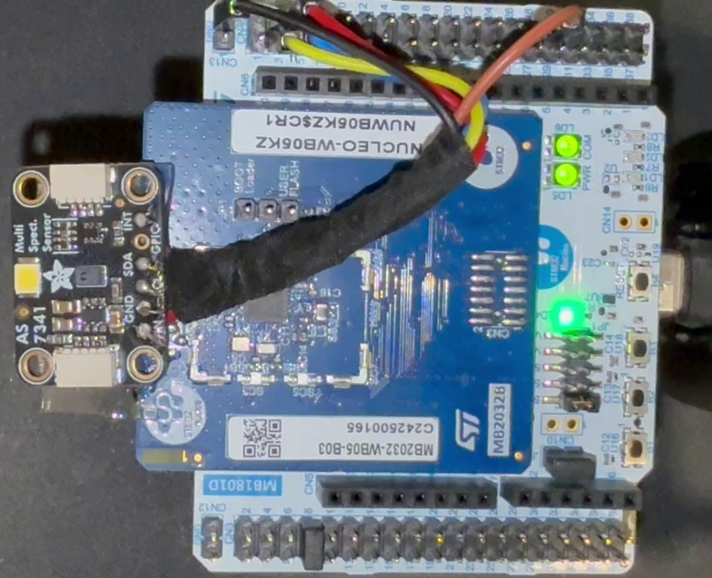

## Hardware-in-the-loop APR

This collection of work demonstrates hardware-in-the-loop APR using Darjeeling with a case study on a photodetector device.

### Summary

In this demonstration, we are starting with a development device consisting of a microcontroller connected to a multi-spectral photodetector.
This is the development hardware for the PulsePatch optical heart rate sensor.
The hardware in question is a STM32WB05 Nucleo attached to an OSRAM AS7341 multispectral sensor.
The setup is show below:

The device is connected to, and can communicate with, a host machine that runs the APR.
On the device a simplified PulsePatch firmware is running which connects to the sensor and periodically takes optical measurements.
Unit tests were created to ensure the microprocessor can correctly communicate with the photodetector and capture the required measurements.
A test harness is present in the firmware which allows a host machine to communicate with the microprocessor and trigger individual unit tests.

During the creation of the unit tests, a defect was uncovered in which trying to capture data too soon after the sensor was initialized would fail.
Using Darjeeling and a communication bridge, APR was performed on the hardware to produce a candidate patch to the problem.

### Directory Structure

There are many files and subdirectories included in this deliverable.
This section will summarize imporant components

#### apr/

The `apr` subdirectory contains the code and configurations required for running Darjeeling.

##### darjeeling/

This is a fork of Darjeeling and some of its dependencies.
Modifications were needed to be made such that the APR tasks were run in Docker containers with elevated permissions so that the serial connection to the hardware could be made.
None of the APR mechanisms were affect by any changes, only communication
From this directory, Darjeeling can be run with:

- `pipenv install`
- `pipenv run darjeeling repair <repair file>`

##### results/

The results of the demonstration can be found here.
Results consist of the entire log generated by Darjeeling during the APR process as well as the candidate patch that was produced.

##### repair.yml

This is the definition of the APR process that is used by Darjeeling.
Of note, the process is restricted to a single thread because there is only a single hardware device to run the unit tests.
Additionally, the build instructions include a step which deploys the built firmware to the device.

#### controller/

This contains the code for a small controller which simplifies the communication between the host machine and the microprocessor.
It wraps both the functionality of the STM32 Programmer, for flashing new firmware to the device, as well as a serial connection to the microprocessor.
The controller implements the host side of the test harness communication protocol, allowing for unit tests to be triggered on the device and results to be read back.
This script is used by Darjeeling to evaluate candidate patches.

#### docker/

This contains the Dockerfiles for the images that are used in the APR as well as an related resources
Once the images have been built, nothing more needs to be done with this files.

#### p3/

This contains the firmware for the device -- "p3" stands for "pulse patch proxy" -- as this is a stand-in for the full PulsePatch device.
The majority of this code is boilerplate stm32 code.
The test harness and communication infrastructure can be found in `Src/utils/`.
The app and AS7341 driver that are the subject of the unit tests can be found in `Src/app/`
The unit tests themselves are found under `Src/testing/`

`coverage.yml` is a code coverage file that has been built by hand to provide additional information about the unit tests to Darjeeling.

#### scripts/build_docker.sh

This script builds the relevant images that are needed by Darjeeling.
It should only need to be run once